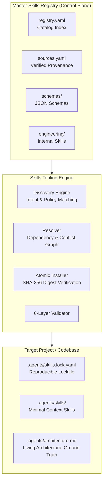

# Engineering Agent Skills Registry

[](https://github.com/engineering-skills/registry/actions/workflows/validate.yml)
[](LICENSE)
[](https://agentskills.io)

A centralized **master registry, governance layer, and distribution mechanism for engineering Agent Skills**.

---

## 1. What This Repository Is & Is Not

### What It Is:
- A **control plane** and curated catalog for engineering skills across technologies, practices, and architectural intelligence.
- An **official-first distribution layer** that prefers verified vendor skills (`mongodb/agent-skills`, `flutter/agent-plugins`, `vercel/next.js`, `grafana/skills`).
- A **context-efficient installer** that installs only the minimal sufficient skill set needed into a project's `.agents/skills/` directory.
- A home for first-class engineering intelligence skills, starting with the **System Architecture & Edge-Case Validator** (`architecture.system-validator`).

### What It Is NOT:
- Not a giant unmaintained documentation dump.
- Not a redundant fork or copy of upstream vendor repositories.
- Not a runtime environment or package manager for general software dependencies.
- Not a storage location for project-specific application code or architecture documents.

---

## 2. Conceptual Architecture



---

## 3. Supported Initial Scope

| Skill ID | Type | Status | Upstream Provider & Repository | Focus Area |
| :--- | :--- | :--- | :--- | :--- |
| **`mongodb`** | `technology` | `official` | [mongodb/agent-skills](https://github.com/mongodb/agent-skills) | Schema design, aggregation pipelines, Atlas optimization |
| **`flutter`** | `technology` | `official` | [flutter/agent-plugins](https://github.com/flutter/agent-plugins) | Flutter/Dart widgets, state management, testing |
| **`nextjs`** | `technology` | `official` | [vercel/next.js](https://github.com/vercel/next.js) | App Router, Server Components, cache optimization |
| **`nodejs`** | `technology` | `curated` | [Paldom/node-skills](https://github.com/Paldom/node-skills) | Node.js backend patterns, async event loop, streams |
| **`go`** | `technology` | `curated` | [samber/cc-skills-golang](https://github.com/samber/cc-skills-golang) | Idiomatic Go, goroutines, concurrency, error handling |
| **`testing`** | `practice` | `curated` | [engineering-skills/testing](https://github.com/engineering-skills/testing) | Test pyramids, contract testing, mutation testing |
| **`observability-instrumentation`** | `practice` | `curated` | [dash0hq/agent-skills](https://github.com/dash0hq/agent-skills) | OpenTelemetry spans, metrics, traces, context propagation |
| **`observability-platform`** | `practice` | `official` | [grafana/skills](https://github.com/grafana/skills) | Prometheus (PromQL), Grafana, Loki, Tempo, Alloy |
| **`architecture.system-validator`** | `intelligence` | `internal` | `local/engineering-skills` | Architecture ground truth, edge-case audit, invariants |

---

## 4. Official-First Provenance Policy

The repository prioritizes upstream sources according to this strict hierarchy:
1. **Official Vendor-Maintained Agent Skill**: Primary choice whenever published by the technology creator.
2. **Official Vendor Documentation / Core Repo**: Used when no standalone skill exists yet.
3. **Curated Community Skill**: High-quality community projects (e.g. Node.js or Go standards) with pinned commit SHAs and verified hashes.
4. **Internal / Custom Skill**: Authored in this repository only for cross-cutting meta-skills (e.g. `architecture.system-validator`).

Every external entry in `sources.yaml` pins an **immutable Git commit SHA** and **SHA-256 integrity hash**.

---

## 5. System Architecture & Edge-Case Validator

Located at `engineering/architecture/system-validator/`, this engineering intelligence skill acts as an expert software architect and QA verification engine.

### Capabilities:
- **`/analyze-codebase`**: Scans the project AST, data models, API boundaries, and async flows, generating modular domain-scoped Mermaid.js diagrams and saving living ground truth to `.agents/architecture.md`.
- **`/audit-plan [plan.md]`**: Performs differential analysis (e.g., Create vs. Edit) and audits plans against a 28-category edge-case matrix, generating machine-readable JSON findings and an enhanced plan.
- **`/validate-implementation`**: Runs post-implementation to verify that living invariants and edge cases are handled, outputting structured verdicts (`PASS`, `PASS_WITH_WARNINGS`, `FAIL`, `BLOCKED`, `UNKNOWN`).

---

## 6. CLI Quick Start

### Installation
```bash
# Clone the repository
git clone https://github.com/engineering-skills/registry.git
cd registry

# Set up environment
python3 -m venv .venv
source .venv/bin/activate
pip install -r requirements.txt
```

### Basic Commands
```bash
# 1. List all available skills
./bin/skills list

# 2. Search for skills
./bin/skills search "mongodb"

# 3. Explainable discovery based on task intent
./bin/skills discover "build a production Node.js API with MongoDB and metrics"

# 4. View detailed skill metadata & provenance
./bin/skills info mongodb

# 5. Atomically install skills into your project
./bin/skills install nodejs mongodb architecture.system-validator --target=/path/to/my-project

# 6. Check for updates against master registry
./bin/skills update --target=/path/to/my-project

# 7. Run 6-layer validation suite
./bin/skills validate --strict
```

---

## 7. Validation Engine

The repository includes a 6-layer validation engine enforced on every Pull Request:
1. **Layer 1: Syntax & Schemas Gate**: Validates all YAML files against JSON Schema Draft 2020-12.
2. **Layer 2: Referential Integrity Gate**: Checks source providers, IDs, and entrypoints.
3. **Layer 3: Graph & Conflicts Gate**: Detects circular dependencies and conflicts using 3-color DFS.
4. **Layer 4: Provenance & Integrity Gate**: Enforces 40-char commit SHAs, SHA-256 hashes, and licenses.
5. **Layer 5: Content Structure Gate**: Verifies internal `SKILL.md` frontmatter and referenced templates.
6. **Layer 6: Installation Simulation Gate**: Dry-runs dependency resolution and staging for all skills.

---

## 8. Repository Structure

```text
engineering-skills/
├── AGENTS.md                          # Mandatory agent instructions
├── README.md                          # Developer guide
├── LICENSE                            # Apache-2.0 License
├── requirements.txt                   # PyYAML, jsonschema, pytest
│
├── registry.yaml                      # Master catalog of skills
├── sources.yaml                       # Upstream providers & provenance records
│
├── schemas/                           # JSON Schema Draft 2020-12
│   ├── registry.schema.json
│   ├── sources.schema.json
│   ├── manifest.schema.json
│   └── lockfile.schema.json
│
├── skills/                            # Managed Technology & Practice Manifests
│   ├── mongodb/
│   ├── flutter/
│   ├── nextjs/
│   ├── nodejs/
│   ├── go/
│   ├── testing/
│   └── observability/
│       ├── instrumentation.yaml
│       └── platform.yaml
│
├── engineering/                       # First-Class Internal Skills
│   └── architecture/
│       └── system-validator/
│           ├── SKILL.md
│           ├── manifest.yaml
│           ├── schemas/
│           └── templates/
│
├── tools/                             # CLI Tooling & Resolution Engine
│   ├── cli.py
│   ├── core/                          # Models, config, loaders
│   ├── search/                        # Search engine
│   ├── discovery/                     # Explainable discovery engine
│   ├── resolver/                      # Dependency & conflict resolver
│   ├── installer/                     # Atomic installer & lockfile manager
│   ├── update/                        # Updater
│   └── validator/                     # 6-layer validation engine
│
├── tests/                             # Comprehensive test suite (31 tests)
│   ├── unit/
│   ├── integration/
│   └── validation/
│
├── bin/
│   └── skills                         # Executable CLI wrapper
└── .github/
    └── workflows/
        └── validate.yml               # Multi-platform CI pipeline
```

---

## 9. Roadmap

- **V1 (Current)**:
  - Master catalog, verified provenance, JSON schemas, 6-layer validation.
  - Initial 9 technology and practice domains.
  - Complete `architecture.system-validator` skill with schemas and templates.
  - Deterministic explainable discovery, graph resolver, atomic installer, lockfile.
  - 100% test coverage with 31 automated unit and integration tests.
- **V1.5**:
  - Remote authenticated git checkout during installation.
  - Upstream release watcher bot for automated provenance updates.
- **Future**:
  - Optional MCP Server bindings (`search_skills()`, `install_skill()`, etc.).
  - Semantic vector embedding index for natural language search.
