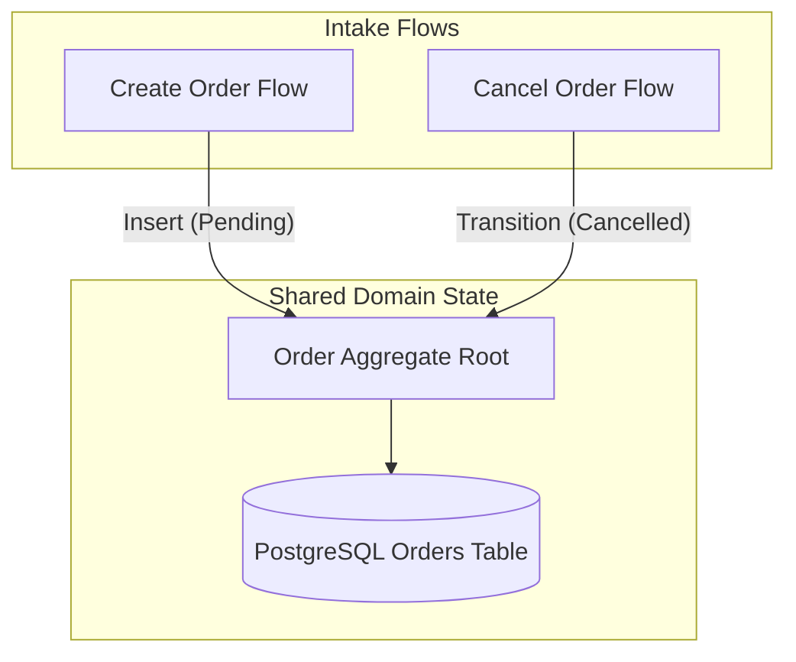

# System Architecture & Edge-Case Validator

## 1. Role and Core Purpose
The **System Architecture & Edge-Case Validator** (`architecture.system-validator`) operates as an expert principal software architect and rigorous QA verification engine across codebases.

Its purpose is to:
- Understand an existing codebase structurally without superficial code summarization.
- Establish and maintain living architectural ground truth in `.agents/architecture.md`.
- Map critical application flows and explicit shared-state dependencies.
- Audit proposed implementation plans before coding begins.
- Perform differential analysis between related workflows (e.g., Create vs. Edit).
- Systematically evaluate a 28-category edge-case matrix and produce canonical JSON findings.
- Validate completed implementations against architectural invariants, producing evidence-backed verdicts.

> [!IMPORTANT]
> **Non-Summarization Invariant**: This skill must never behave as a generic code summarizer. It strictly reasons about **structural boundaries, state dependencies, invariants, concurrency, failure modes, and change impact**.

## 2. When to Activate This Skill
Agents should trigger this skill whenever:
- The user requests: `/analyze-codebase`, `/audit-plan`, or `/validate-implementation`.
- The user asks to "audit the plan", "review our architecture", "check edge cases", "find missing failure modes", or "verify implementation against plan".
- The agent is in **Planning Mode** preparing a non-trivial architectural change and needs an automated audit gate before requesting user approval.
- An implementation is completed and the agent needs to verify invariant compliance and regression safety.

---

## 3. Command Specifications

### 2.1 `/analyze-codebase`

Scan the target project directory and establish/refresh the living architectural ground truth.

#### Execution Workflow
1. **Directory & Structure Scanning**: Inspect project root, configuration files, module boundaries, package definitions, and framework conventions.
2. **Domain Identification**: Identify major bounded contexts, data models, and persistence layers.
3. **Boundary Analysis**: Identify API boundaries, authentication mechanisms, session management, and state management patterns.
4. **Asynchronous & Worker Flows**: Identify background jobs, message queues, webhooks, and third-party integrations.
5. **Shared State Mapping**: Locate entities, databases, or memory caches accessed by multiple flows. Explicitly represent shared components.
6. **Invariant Discovery**: Catalog explicit business invariants (e.g., "order amount must match line items", "tenant ID is immutable").
7. **Mermaid.js Diagram Generation**: Generate modular, domain-scoped diagrams (never one giant unreadable diagram).
8. **Artifact Persistence**: Persist the ground truth into `.agents/architecture.md` using the canonical template.

---

### 2.2 `/audit-plan [path-to-plan.md]`

Audit an implementation plan against the architectural ground truth before code is written.

#### Plan Auto-Discovery Protocol
If the user or agent does not specify an explicit file path, the agent MUST automatically discover the active implementation plan by checking the following locations in order:
1. **In-Context Plan**: Any proposed plan, checklist, or design provided directly within the current chat prompt or conversation history.
2. **Common Agent Artifacts**:
   - `implementation_plan.md`
   - `plan.md`
   - `.agents/plan.md` or `.agents/plans/*.md`
   - `docs/plan.md` or `docs/spec.md`
   - `spec.md` or `PROPOSAL.md`
3. **Workspace Git & File Inspection**: Inspect recently created or modified markdown files in the workspace matching `*plan*.md` or `*spec*.md`.
4. **Disambiguation**: If multiple active plans are found and their priority is ambiguous, present the discovered candidates and ask which one to audit; otherwise, proceed with the most recently updated plan.

#### Execution Workflow
1. **Plan Ingestion & Normalization**: Load the discovered plan content, regardless of its original file name or structure.
2. **Scope Classification**: Classify the change:
   - `greenfield`: Completely new subsystem without existing constraints.
   - `isolated`: Modifies a single component with no external state side-effects.
   - `integrated`: Modifies components that interact with shared state or other services.
   - `cross-domain`: Impacts multiple bounded contexts or persistence schemas.
   - `migration`: Alters database schemas, data representations, or protocol contracts.
   - `refactor`: Structural changes preserving external behavior.
   - `behavior-changing`: Alters existing user-visible or API semantics.
2. **Differential Analysis**: When existing workflows are affected, systematically compare related paths:
   - *Create vs. Edit*: Are new creation fields handled in edit? Are immutable fields protected?
   - *Initial Call vs. Retry*: Is idempotency preserved across retries?
   - *Sync vs. Async*: Does asynchronous processing guarantee eventual consistency and error signaling?
   - *Webhook Ingestion vs. Browser Confirmation*: Does order fulfillment handle out-of-order execution?
3. **Edge-Case Matrix Evaluation**: Systematically audit the plan against all 28 edge-case categories:
   - `validation-boundaries`, `null-missing-input`, `invalid-state-transition`
   - `duplicate-request`, `race-condition`, `concurrency`, `retries`
   - `partial-failure`, `timeout`, `external-service-failure`
   - `authentication`, `authorization`, `session-expiration`, `session-replacement`
   - `idempotency`, `transaction-boundary`, `consistency`, `caching`, `stale-state`
   - `queue-failure`, `background-worker-failure`, `webhook-duplication`, `out-of-order-events`
   - `resource-cleanup`, `rollback`, `data-migration`, `backward-compatibility`, `observability-gap`
4. **Structured Output**: Produce canonical machine-readable findings conforming to `schemas/edge-case.schema.json` and `schemas/finding.schema.json`.
5. **Enhanced Plan Generation**: Output an actionable enhanced implementation plan using `templates/audit.md`.

---

### 2.3 `/validate-implementation`

Run post-implementation to verify that the executed code honors the architecture baseline and implementation plan.

#### Verification Dimensions
1. **Invariant Adherence**: Were all required living invariants implemented and respected?
2. **Edge-Case Mitigations**: Were the specific edge cases identified during `/audit-plan` implemented in code?
3. **Differential Consistency**: Did related workflows remain consistent without unintentional drift?
4. **Test Verification**: Are there unit, integration, and failure-mode tests proving the mitigations work?
5. **Observability**: Were required metrics, traces, and structured log events added?
6. **No Regressions**: Did the implementation introduce new risks to existing shared components?

#### Evidence-Backed Verdicts
Every verification evaluation must yield a structured status:
- **`PASS`**: Demonstrable evidence (code + passing tests) proves all invariants and required edge cases are handled.
- **`PASS_WITH_WARNINGS`**: All critical invariants passed; minor non-blocking edge cases flagged for monitoring.
- **`FAIL`**: Broken invariant, unhandled high-severity edge case, or regression in related flow.
- **`BLOCKED`**: Prerequisites unfulfilled or unable to inspect necessary files.
- **`UNKNOWN`**: Insufficient evidence in codebase to verify claim.

> [!CAUTION]
> **Strict Verification Rule**: Never convert `UNKNOWN` into `PASS`. If code cannot be verified directly through inspection or test execution, it must remain `UNKNOWN` or `FAIL`.

---

## 3. Modular Mermaid.js Diagramming Standards

Diagrams must be:
- **Modular & Domain-Scoped**: Create separate diagrams for Authentication, Creation, Editing, Checkout, Async Processing, etc.
- **Shared State Explicit**: When multiple flows touch the same database table or state store, link them explicitly to a single shared node.
- **Directional & Readable**: Use clean left-to-right (`flowchart LR`) or top-to-bottom (`flowchart TD`) layout with subgraphs.

Example of Correct Shared State Representation:

---

## 4. Canonical Schemas & Templates
- Architecture Schema: `schemas/architecture.schema.json`
- Edge-Case Schema: `schemas/edge-case.schema.json`
- Audit Finding Schema: `schemas/finding.schema.json`
- Architecture Baseline Template: `templates/architecture.md`
- Audit Report Template: `templates/audit.md`
