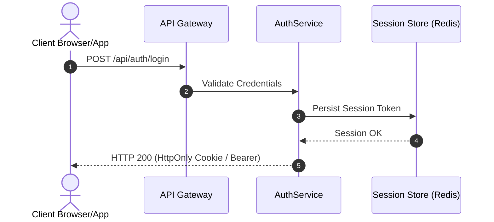
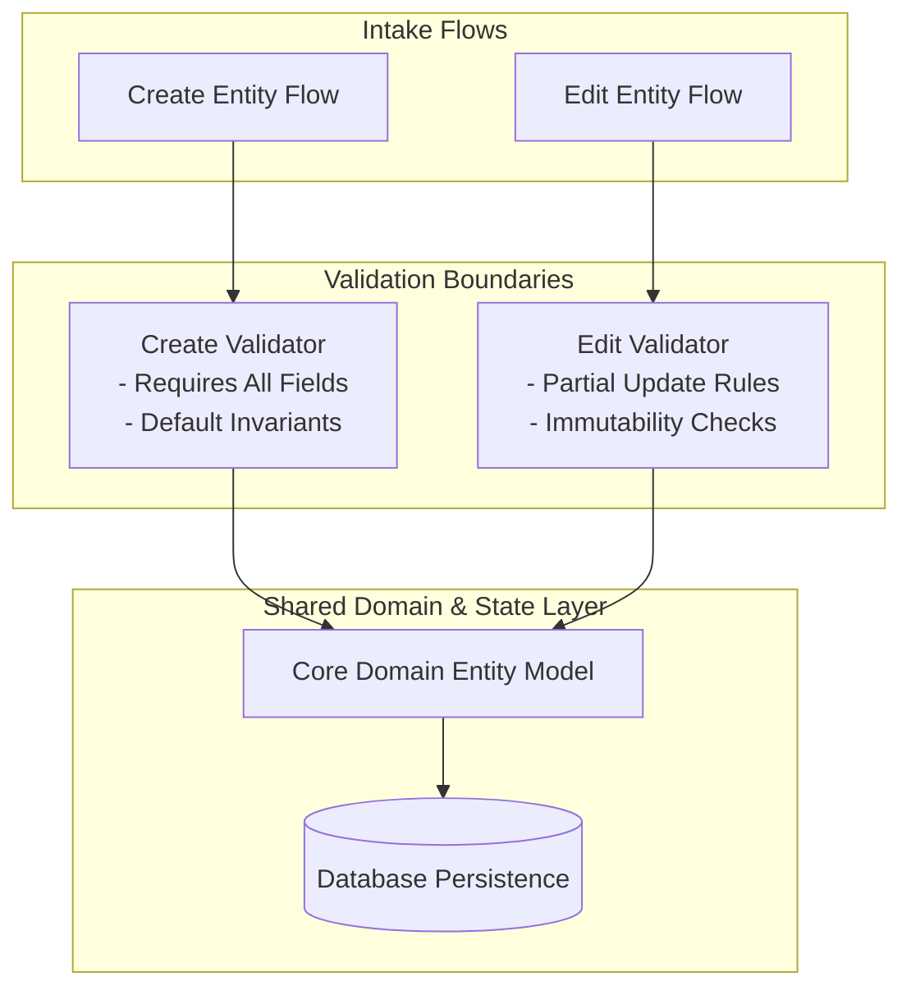
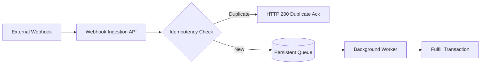

# System Architecture Baseline & Ground Truth

> **Target Project Artifact**: `.agents/architecture.md`  
> **Status**: Living Architectural Ground Truth  
> **Last Updated**: {{UPDATED_AT}}  
> **Audited By**: `architecture.system-validator`

---

## 1. Executive System Overview
- **Project Name**: {{PROJECT_NAME}}
- **Architecture Pattern**: {{ARCHITECTURE_PATTERN}} (e.g., Modular Monolith, Microservices, Event-Driven)
- **Primary Runtime & Stack**: {{RUNTIME_AND_STACK}}

---

## 2. Domains & System Boundaries

| Domain | Scope & Responsibilities | Key Components | Entry Points |
| :--- | :--- | :--- | :--- |
| **Authentication & Identity** | Session issuance, token lifecycle, RBAC | AuthController, TokenService | `/api/auth/*` |
| **Core Business Domain** | Creation, editing, entity lifecycle | CoreService, Repository | `/api/entities/*` |
| **Async & Background** | Queue consumption, delayed tasks | WorkerService, EventBus | Queue listeners |
| **External Integrations** | Third-party webhooks, payments, sync | WebhookHandler, ExtClient | `/api/webhooks/*` |

---

## 3. Modular Domain Architecture Diagrams

### 3.1 Authentication & Session Management

### 3.2 Creation vs. Edit Lifecycle (Shared State Integration)

### 3.3 Asynchronous Processing & Webhook Retries

---

## 4. Shared State & Entities
Explicitly documents all state accessed across multiple business flows to prevent split-brain logic.

| Shared Entity / Store | Accessed By Flows | Concurrency Control | Invariants |
| :--- | :--- | :--- | :--- |
| `UserAccount` | Login, ProfileEdit, Billing | Optimistic Locking (`version`) | Email must be unique, verified |
| `OrderState` | Checkout, PaymentWebhook, AdminCancel | State Machine Transition Table | Terminal states cannot be edited |

---

## 5. Persistence & Transaction Boundaries
- **Primary Data Store**: {{DATA_STORE}}
- **Transaction Scope**: Single-document atomic updates / multi-table ACID boundaries
- **Isolation Level**: Read Committed / Serializable

---

## 6. Living Architectural Invariants

| ID | Invariant Statement | Enforcing Component | Classification |
| :--- | :--- | :--- | :--- |
| **INV-001** | All write requests must pass authorization before hitting domain layer. | AuthMiddleware | **Verified** |
| **INV-002** | External webhook processing must be idempotent on event ID. | WebhookConsumer | **Verified** |
| **INV-003** | Deleted records must be soft-deleted and cascade to related tokens. | EntityRepository | **Known Architectural** |
| **INV-004** | Session tokens expire after 24 hours of inactivity. | TokenManager | **Identified Risk** |

*Classifications: `Verified` (code & tests prove it), `Known Architectural` (established design), `Identified Risk` (potential weakness), `Unknown / Cannot Verify` (unverified assumption).*

---

## 7. Known Risks & Edge-Case Hotspots
- **Race Condition in Async Fulfillment**: Webhook may arrive before browser confirmation redirect completes.
- **Cache Invalidation Lag**: Distributed cache may serve stale entity state for up to 60 seconds after edit flow.
